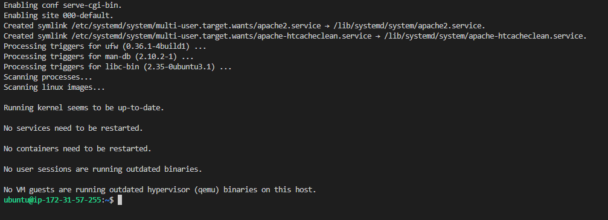

## Documentation for Project 1
## Web stack implementation (lamp stack) - aws web console

## STEP 1 — INSTALLING APACHE AND UPDATING THE FIREWALL

-- Starting by ssh into my server labelled 'Apache Web Server' from my vscode terminal in windows machine 

`sudo apt update`--(running command to update my list of packages in package manager)

 --screenshot shows update completed 

`sudo apt install apache2`--(To run apache2 package installation)
--Screenshot of Apache2 server installation

`sudo systemctl status apache2`--(To verify that apache2 is running as a Service in our OS)

`curl http://localhost:80` --(using curling command with DNS Name option - to check how we can access Apache server locally within ubuntu shell. Objective - Use curl command to request our Apache HTTP Server on port 80.

`http://18.207.140.84:80` --(Opened a new browser and ran command to test if we can view our Apache HTTP server via the internet. Webpage displayed validating Apache web server is operational, after installation on ubuntu system.

## STEP 2 — INSTALLING MYSQL

`sudo apt install mysql-server`--(Mysql database software installed to my apache server)

`sudo mysql` --(successful login into the MySQL console, connected as administrative database user root)

`ALTER USER 'root'@'localhost' IDENTIFIED WITH mysql_native_password BY '<password>';`--(Setting up a default authenticate password for mysql,confirming mysql query for password)

`sudo mysql_secure_installation`--(running interactive security script that comes pre-installed with MySQL to secure my password, password plugin validated).

`mysql -u root -p`--(Test:1. successful login back to MySQL console, and 2. Insert password to gain access to mysql database service).

## STEP 3 — INSTALLING PHP

`sudo apt install php libapache2-mod-php php-mysql`--(Installing all 3 packages to PHP component;1. PHP package, 2. PHP Module, 3. Apache library).

-- (PHP Installation complete)

`php -v`--(Confirming version of PHP installed).

## STEP 4 — CREATING A VIRTUAL HOST FOR YOUR WEBSITE USING APACHE

`sudo mkdir /var/www/evezidomainlamp`--(Creating a domain dircetory (LAMP Stack) in my Apache HTTP server).

`sudo chown -R $USER:$USER /var/www/evezidomainlamp`--(Assign ownership of my new directory to my local machine as regular user).

`sudo vi etc/apache2/site-available/evezidomainlamp.conf`--(crete and open a new configuration file in apache2 sites-available directory inserted script).

`sudo ls /etc/apache2/sites-available`--(Running command to test new file 'evezidomainlamp.conf' exist in sites-available directory).

`sudo a2ensite evezidomainlamp`--(Enabling my new VirtuaHost with 'a2ensite command as Domain Name is not customised').

`sudo apache2ctl configtest` `sudo systemctl reload apache2` --(Testing my configuration file has no syntax error and 2. Apache webserver is reloaded and website is now active).

`sudo echo 'Hello LAMP from hostname' $(curl -s http://169.254.169.254/latest/meta-data/public-hostname) 'with public IP' $(curl -s http://169.254.169.254/latest/meta-data/public-ipv4) > /var/www/evezidomainlamp/index.html`--(Creating an index.html file in that location so that we can test that the virtual host works as expected - Using Public IP address)

--(Using DNS Name to launch website - achieving same result Echoing Public DNS name and Public IP address)

## STEP 5 — ENABLE PHP ON THE WEBSITE

 `sudo vim /etc/apache2/mods-enabled/dir.conf`--(in DirectoryIndex setting - Edit and change 'dir.conf file' order, essentially for index.php file not to be superceded by index.html file with snippit script).

`sudo systemctl reload apache2`--(Apache reloaded for changes to take effect).

`vim /var/www/evezidomainlamp/index.php`--(create a PHP test script to confirm that Apache is able to handle and process requests for PHP files).

--(Webpage displaying information about the server PHP perspective).

`sudo rm /var/www/evezidomainlamp/index.php`--(Removed webpage PHP server as it contains sentive information of my PHP environment and my Ubuntu server).

